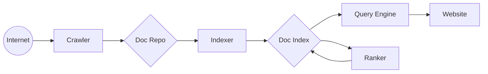

# Bloogle

## WARNING

Right now, the project is only optimized for Windows. Please support the project if you want to change that!

## Index

- [Folders](#folders)
- [Setting up the Project](#setting-up-the-project)
- [ToDo](#todo)
- [Overview](#overview)
- [Crawler](#crawler)
- [Indexer](#indexer)
- [Databases](#databases)

## Folders

`logs/` = Logs

`module/` = Contains Indexer, Web API, Crawler, and ranker

`nginx/` = The webserver for `web/`

`venv/` = Python Virtual Environment

`web/` = HTML

## Setting up the Project

### Manually

1. Run "folder-setup.bat"
2. Download MariaDB from <https://mariadb.org/download/>
   Select "Windows", your Architecture, and Package Type "Zip", not Debug Symbols
3. Unzip it into the "mariadb" folder, so that the bin folder is in the folder directly.
4. Download Nginx from <https://nginx.org/en/download.html>
   Select ``nginx/Windows-x.y.z`` under the "Mainline Version" tag.
5. Unzip it into the nginx folder so that the exe appears at the root.

### Automatic

Still WIP!!!

## Todo

- Setup
  - Automatic Passwords for DB
  - Automatic SQL
- Crawler
  - Robots
  - Autolaunching
  - Refreshing after a week (Low Prio)
- Indexer
  - Indexing
  - Ranking
  - Extracting data
  - Gathering Terms
- Query Engine
  - Query API
  - Properly connecting Website to backend
- Website
  - Language Selector

## Overview

Web search engines get their information by web crawling from site to site. The "spider" checks for the standard filename robots.txt, addressed to it. The robots.txt file contains directives for search spiders, telling it which pages to crawl and which pages not to crawl. After checking for robots.txt and either finding it or not, the spider sends certain information back to be indexed depending on many factors, such as the titles, page content, JavaScript, Cascading Style Sheets (CSS), headings, or its metadata in HTML meta tags. After a certain number of pages crawled, amount of data indexed, or time spent on the website, the spider stops crawling and moves on. "[N]o web crawler may actually crawl the entire reachable web. Due to infinite websites, spider traps, spam, and other exigencies of the real web, crawlers instead apply a crawl policy to determine when the crawling of a site should be deemed sufficient. Some websites are crawled exhaustively, while others are crawled only partially".

Indexing means associating words and other definable tokens found on web pages to their domain names and HTML-based fields. The associations are stored in a public database and accessible through web search queries. A query from a user can be a single word, multiple words or a sentence. The index helps find information relating to the query as quickly as possible.[36] Some of the techniques for indexing, and caching are trade secrets, whereas web crawling is a straightforward process of visiting all sites on a systematic basis.

Between visits by the spider, the cached version of the page (some or all the content needed to render it) stored in the search engine working memory is quickly sent to an inquirer. If a visit is overdue, the search engine can just act as a web proxy instead. In this case, the page may differ from the search terms indexed.[36] The cached page holds the appearance of the version whose words were previously indexed, so a cached version of a page can be useful to the website when the actual page has been lost, but this problem is also considered a mild form of linkrot.

Typically, when a user enters a query into a search engine it is a few keywords.[38] The index already has the names of the sites containing the keywords, and these are instantly obtained from the index. The real processing load is in generating the web pages that are the search results list: Every page in the entire list must be weighted according to information in the indexes.[36] Then the top search result item requires the lookup, reconstruction, and markup of the snippets showing the context of the keywords matched. These are only part of the processing each search results web page requires, and further pages (next to the top) require more of this post-processing.

## Crawler

1. Look at robots.txt
2. Crawl Page
3. Get all Redirects
4. If needed, rewrite links so they are total.
5. Remove all pages that robots.txt doesn't allow.
6. Put all links into queue
7. Visit next page, increase depth by one.
8. Return HTML and all images to the Storage.
9. Repeat steps 2-8 until no more pages are found.

    Acknowledge robots.txt when entering a different domain. This also counts for subdomains.

    Skip spammy domains automatically.

    Never go further than a certain depth.

    If no more new pages can be found, step back.

    If no more new pages can be found on the root, quit.

    Should the Bot meet the crawling quota, quit automatically.

## Indexer

1. The indexer takes a crawled element and extracts the most important elements.

    Usually, these elements are images, the title, icons and the link to the page.

2. The Indexer extracts the important text from the page.

3. It rearranges the data into index.db

4. Update repo.db so it doesn't have to do it again



## Databases

```bash
MariaDB
├── index
│   ├── pages
│   │   ├── ID              ID      Primary Key, Not Null <┐
│   │   ├── Title           String  Not Null               │
│   │   ├── URL             String  Not Null, Unique       │
│   │   ├── Icon_URL        String  Not Null               │
│   │   ├── Text            String  Not Null               │
│   │   ├── Language        String  Not Null               │
│   │   └── LastEditDate    Date    Not Null               │
│   ├── dictionary                                         │
│   │   ├── ID              ID      Primary Key, Not Null  │
│   │   └── Term            String  Not Null, Unique       │
│   └── ranks                                              │
│       ├── ID              ID      Primary Key, Not Null  ┘
│       ├── Term            String  Not Null
│       ├── Rank            Int     Not Null
│       └── page_ID         ID      Foreign Key, Not Null
│
├── repo
│   ├── queue
│   │   ├── ID              ID      Primary Key, Not Null
│   │   ├── Link            String  Not Null, Unique
│   │   └── AddDate         Date    Not Null
│   ├── robots
│   │   ├── ID              ID      Primary Key, Not Null
│   │   ├── Domain          String  Not Null
│   │   ├── Path            String  Not Null
│   │   └── Allowed         Bool    Not Null
│   └── raw
│       ├── ID              ID      Primary Key, Not Null
│       ├── Link            String  Not Null, Unique
│       ├── HTML            String  Not Null
│       ├── Language        String  Not Null
│       └── LastUpdate      Date    Not Null
│
└── sql_users
    ├── crawler -> repo.*: Read, Insert, Delete
    ├── indexer -> repo.raw: Read
    │              index.dictionary: Read, Insert, Delete
    │              index.pages: Insert, Update, Delete
    ├── ranker -> index.pages, index.dictionary: Read
    │             index.ranks: Read, Insert, Update, Delete
    └── query -> index.*: Read
                 (TEMPORARY!!!): repo.raw: Read
```

```bash
CREATE DATABASE IF NOT EXISTS `index`;
CREATE DATABASE IF NOT EXISTS `repo`;

USE `index`;

CREATE TABLE IF NOT EXISTS `pages` (
  `ID` int(11) NOT NULL,
  `Title` tinytext NOT NULL,
  `URL` text NOT NULL,
  `Icon_URL` text NOT NULL,
  `Text` text NOT NULL,
  `LastEditDate` date NOT NULL,
  PRIMARY KEY (`ID`),
  UNIQUE KEY `URL` (`URL`) USING HASH
);

CREATE TABLE IF NOT EXISTS `ranks` (
  `ID` int(10) unsigned NOT NULL,
  `Rank` int(10) unsigned NOT NULL,
  `Term` tinytext NOT NULL,
  `Page_ID` int(11) NOT NULL DEFAULT 0,
  PRIMARY KEY (`ID`),
  KEY `P_ID` (`Page_ID`),
  CONSTRAINT `P_ID` FOREIGN KEY (`Page_ID`) REFERENCES `pages` (`ID`) ON DELETE NO ACTION ON UPDATE CASCADE
);

USE `repo`;

CREATE TABLE IF NOT EXISTS `queue` (
  `ID` int(11) NOT NULL,
  `Link` text NOT NULL,
  `AddDate` datetime NOT NULL,
  PRIMARY KEY (`ID`),
  UNIQUE KEY `Link` (`Link`) USING HASH
);

CREATE TABLE IF NOT EXISTS `dictionary` (
  `ID` int(11) NOT NULL,
  `Term` tinytext NOT NULL,
  PRIMARY KEY (`ID`),
  UNIQUE KEY `Term` (`Term`) USING HASH
);

CREATE TABLE IF NOT EXISTS `raw` (
  `ID` int(11) NOT NULL,
  `Link` text NOT NULL,
  `HTML` mediumtext NOT NULL,
  `LastUpdate` datetime NOT NULL,
  PRIMARY KEY (`ID`),
  UNIQUE KEY `Link` (`Link`) USING HASH
);
```
